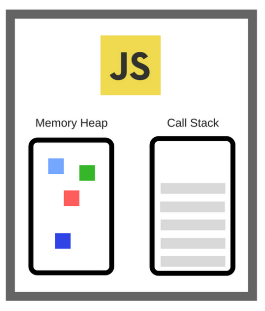
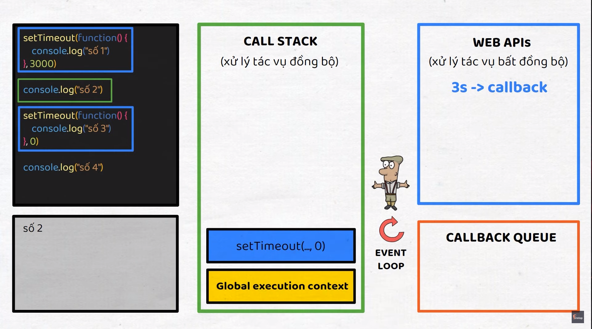
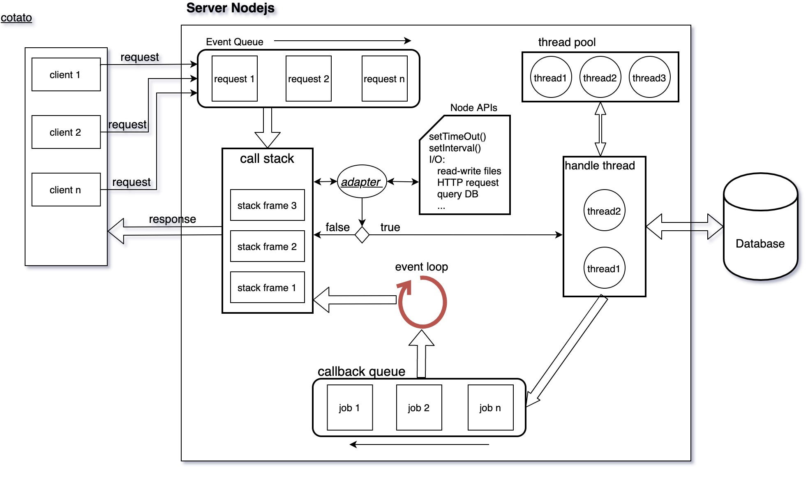

## V8 Engine

V8 là một engine JavaScript (runtime) mã nguồn mở được phát triển bởi Google. Nó được sử dụng rộng rãi trong nhiều ứng dụng khác nhau, bao gồm cả trình duyệt Chrome và Node.js

## Single Thread

Javascript là single thread, là đơn luồng, chỉ chạy một thứ ở một thời điểm

## Call stack

## Stack trace

Là một danh sách các lời gọi hàm được ghi lại khi một lỗi xảy ra. Stack trace hiển thị thứ tự các hàm được gọi dẫn đến lỗi, giúp lập trình viên hiểu được con đường thực thi của chương trình đến thời điểm xảy ra lỗi.

## Stack overflow

Hay còn gọi là Maximum call stack size exceeded

## Blocking

Không có gì là blocking cả, nó chỉ là 1 thứ gì đó chạy chậm như: vòng for chạy 1 triệu lần, api request, network request, ...

Khi những thứ chạy lâu như vậy mà chạy trên `Call stack` thì sẽ rất tốn thời gian, dẫn đến block những thứ còn lại

## Asynchronous (bất đồng bộ)

Những thứ gì là bất đồng bộ thì được `call stack` chuyển qua `Web API` một `timer` để xử lý, sau khi xử lý xong thì `Web API` trả về cho `Callback queue` một call back.

`Eventloop` sẽ kiểm tra xem `Call stack` có trống không, có cái gì sắp đưa vào `call stack` không, nếu không thì sẽ chuyển lần lượt các callback từ `callback queue` vào `call stack` để chạy

Thuật ngữ `callback` sẽ đi đôi với `event`

## Event Loop là gì ?

Eventloop là một phần quan trọng của hệ thống runtime của Node.js, nó xử lý các sự kiện và callback trong ứng dụng Node.js.
Khi chạy chương trình, nó sẽ tạo ra một Eventloop và một Thread để xử lý các sự kiện và call back

Eventloop là một vòng lặp vô tận để kiểm tra các sự kiện và thực hiện các callback tương ứng. Nó cũng điều khiển việc thực hiện các tác vụ khác trong chương trình Node.js, như đọc và ghi từ các I/O, gửi và nhận dữ liệu từ mạng, ...

Có 2 loại sự kiện mà Eventloop xử lý: sự kiện đồng bộ và sự kiện bất đồng bộ. Sự kiện đồng bộ được xử lý ngay lập tức trong vòng lặp Eventloop, trong khi sự kiện bất đồng bộ được đưa và một hàng đợi và xử lý sau khi các sự kiện đồng bộ đã được xử lý xong

#### Vì sao JS đơn luồng

Vì nó chỉ có một `event queue`, một `call stack`, một `event loop`, một `callback queue`. Đối với các ngôn ngữ khác như Java, thì mỗi request được gửi từ client, server sẽ có 1 thread riêng để xử lý request đó. Như vậy các request là song song đồng thời. Nhưng ở Nodejs thì không như vậy, vì nó chỉ có đơn luồng, việc dùng chung các tài nguyên hẳn là sẽ xảy ra các tranh chấp.

#### Bắt đầu

- Khi có nhiều request được gửi từ nhiều client trong cùng một thời điểm, các request này sẽ được đưa vào `event queue` hoạt động theo cơ chế FIFO - First In First Out.
  request được lấy ra ở `event queue` sẽ được đưa đến `call stack` để xử lý. Ở đây, trên server sẽ thực thi các hàm để có kết quả trả về cho request đó
- Như vậy, tại 1 thời điểm Nodejs chỉ có thể phục vụ được 1 request duy nhất, vậy nếu request này xử lý quá lâu như cần query vào DB, thì hiển nhiên các request khác trong `event queue` sẽ phải đợi và có thể dẫn đến timeout.
- Nếu chỉ có mỗi V8 engine thì sẽ xảy ra vấn đề như vậy. Nên Nodejs cần thêm một số thành phần khác. Đó là Node APIs, libuv.

#### Bước thứ 2

- Rõ ràng nếu chỉ có V8 engine thì nó không thể thực hiện query vào DB được. Vì V8 engine được thiết kế ra chỉ để thực hiện các phép toán, thực thi hàm, cung cấp data type, object… và GC(thành phần rọn rác cho bộ nhớ).
- Đa phần khi server nhận được request, sẽ phải query vào trong DB, lấy ra dữ liệu, xử lý dữ liệu đó rồi trả về cho client. Đó gần như là một vòng khép kín.
  Khi trong `call stack` thực thi một hàm của một request, hàm này cần phải query dữ liệu trong DB. Vì query vào DB là hoạt động I/O được quy định trong Node APIs. Do vậy nó không thể thực thi trên `call stack` được. Giống như setTimeout() có trong ví dụ phần 1. Nó sẽ được thực thi ở một nơi khác.

#### Nơi khác là nơi nào?

- Làm thế nào để đoạn mã trong `call stack` biết được nó có được Node APIs đảm nhiệm không?
- Theo mình nghĩ chỗ này sẽ có một `adapter` chuyên check việc hàm đó có hay không trong Node APIs.
- Nếu hàm không thực thi một tác vụ liên quan đến I/O thì `adapter` sẽ trả về false. Ví dụ, request yêu cầu lấy thời gian của server, khi đó chỉ cần return new Date() rồi response về cho client. Như vậy hàm mà có return new Date() không liên quan đến Node APIs nên nó sẽ được xử lý ngay trong `call stack` với thời gian rất nhanh và trả về cho client luôn.
- Nếu nó thực thi một tác vụ liên quan đến I/O thì `adapter` sẽ trả về true. Ví dụ như việc query vào DB, sẽ cần một thời gian nhất định. Khi đó Node APIs biết mình cần phải xử lý cái hàm đó. Nó sẽ lấy ra khỏi `call stack` để cho `call stack` thực thi các hàm khác. Đồng thời phân cho 1 thread có trong `thread pool` để xử lý tác vụ I/O trong hàm vừa lấy ra. Chỗ này là bắt đầu đa luồng rồi nhé lại quay về kiến thức của Java
- Luồng này sẽ được xử lý trong handle thread, lấy dữ liệu trong DB, sau khi xong sẽ được đẩy xuống `callback queue` chờ ngày được lên `call stack`
  Khi đó `event loop` bắt đầu nhiệm vụ. Kiểm tra nếu `call stack` rỗng nó sẽ đưa hàm ở `callback queue` lên và thực thi các câu lệnh tiếp theo. Sau khi xong nó sẽ return về kết quả và response về cho client và câu chuyện đến đây là hết rồi.

#### Đa luồng vẫn có trong Nodejs

- Phân tích ở phía trên với chỉ 1 request. Còn nếu nhiều request đồng thời thì Nodejs vẫn cần đa luồng để xử lý các tác vụ I/O.
- Khi 1 request cần query vào DB để lấy dữ liệu. Nó sẽ được một thread nào đó đảm nhiệm. Khi có `call stack` rỗng nó sẽ tiếp nhận các request tiếp theo trong `event queue` để xử lý tiếp. Nếu request này tiếp tục chứa tác vụ I/O thì sẽ được một thread khác đảm nhiệm tiếp. Đó là lý do chúng ta có `thread pool` - một thành phần của libuv.
- Chúng ta có thể lợi dụng điểm này để chạy các tác vụ cùng query 1 lúc trên nhiều thread khác nhau bằng việc sử dụng Promise.all().
  Các hàm có trong Node APIs đều được xử lý dựa vào đa luồng có trong `thread pool`. Nếu nói Nodejs có đa luồng không, thì mình nghĩ trong những trường hợp nhất định, Nodejs vẫn có đa luồng.

## Macro-task và Micro-task

`Macro-task` (task queue): setTimeout, setInterval, setImmediate, I/O, UI render, ...
`Micro-task` (job queue): promise, process.nextTick, async/await, ...
